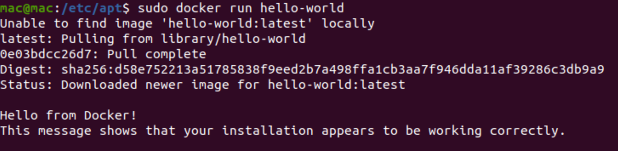

[toc]


## 1.  安装docker

### 1.1 ubuntu上安装

- 配置docker的apt源

  ```shell
  sudo apt-get install apt-transport-https ca-certificates curl software-properties-common
  ```

- 添加docker官方的GPG key

  ```shell
  curl -fsSL https://download.docker.com/linux/ubuntu/gpg | sudo apt-key add -
  ```

- 将docker的源添加到/etc/apt/sources.list

  ```shell
  sudo add-apt-repository \ "del [arch=amd64]
  https://download.docker.com/linux/ubuntu \ $(lsb_release -cs) \ stable"
  ```

- 安装docker

  ```shell
  sudo apt-get update && sudo apt-get install docker-ce
  ```


## 2.  运行第一个容器

### 2.1 首先要配置一个国内的镜像加速

 - 新建一个文件/etc/docker/daemon.json，内容如下：

   ```shell
   {
   	"registry-mirrors": ["http://hub-mirros.c.163.com"]
   }
   systemctl restart docker重启容器
   ```

  - 环境搭建好后，马上运行第一容器，执行下面的命令：

    ```shell
    docker run -d -p 80:80 httpd
    ```

 - 启动流程：
   	- docker客户端执行docker run命令
   	- docker daemon发现发现本地没有httpd镜像
   	- docker从docker hub下载httpd镜像
   	- 下载完成，httpd镜像保存到本地
   	- docker daemon启动httpd镜像


## 3. 镜像内部结构

### 3.1.1 hello-world 最小镜像

- hello-world 是最小的镜像，不到2kb，通常用来验证docker是否安装成功。

  

- hello-world的Dockerfile只包含三条指令：

  - From scratch 是指镜像从0开始。
  - COPY hello /  将文件“hello” 复制到镜像的根目录。
  - CMD ["/hello"] 容器启动时，执行/hello。


### 3.1.2 base镜像

>  提供一个基本的操作系统环境，用户可以根据需求安装和配置软件的基本镜像。

base镜像有两层含义：

1. 不依赖其他镜像。从stratch开始构建。
2. 其他镜像可以以之为基础进行扩展。

常见的基础镜像包括Ubuntu， Centos， Debian等。


一个CentOS镜像只有200MB？Linux操作系统由内核空间和用户控件组成。

1. rootfs

   内核空间是kernel，Linux启动时回家在bootfs文件系统，启动后会写在bootfs文件系统。

   用户空间的文件系统是rootfs，包含/dev, /proc, /bin等目录。对于base镜像来说，底层直接用宿主机HOST的内核， 自己只需要提供rootfs就行了。所以CentOS才200MB！有的镜像，如alphine，则更小，只有10MB！

2. base镜像提供的是最小安装的Linux发行版

   CentOS镜像的Dockerfile的内容是：

   ```shell
   FROM scratch
   ADD centos-7-docker.tar.gz /
   CMD ["/bin/bash"]
   ```

   ADD指令添加到镜像的tar包是centos7的rootfs，会自动解压到根目录下，生成/dev, /proc, /bin等目录。

   *可在Docker Hub的镜像描述页查看Dockerfile*

3. 支持运行多种LinuxOS，需要注意的是：

   1. base镜像的用户空间和发行版一致，内核版本和发行版是不同的，因为内核和宿主机一样。
   2. 容器职能使用宿主机的内核kernel，并且不能修改。

### 3.1.3 镜像的分层结构

新的镜像是在base镜像的基础上一层一层的叠加生成的，每安装一个软件，就在现有镜像的基础上增加一层。这么做的好处是：**共享资源**。举个例子：

```shell
FROM debian
RUN apt-get install emacs
RUN apt-get install apache2
CMD ["/bin/bash"]
```

说明：

- 新镜像从debian的base镜像的基础上构建。
- 安装emacs编辑器。
- 安装apache服务器。
- 容器启动时运行bash。


​		